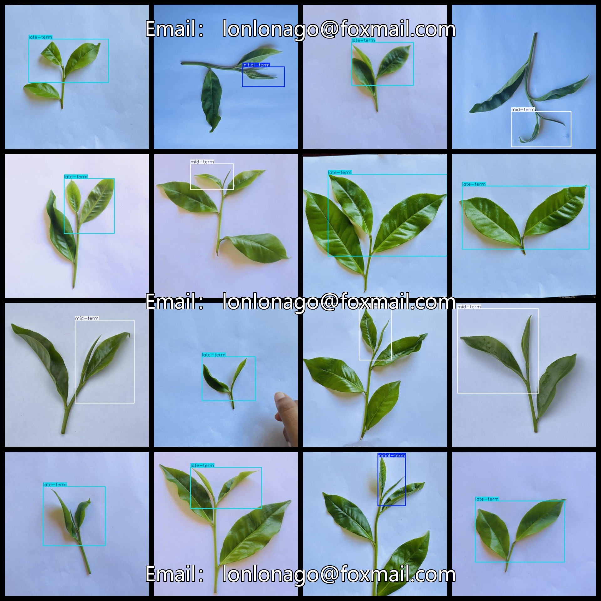

# Tea Buds Growth Stage Dataset 752 imagesVOC+YOLO format

Tea Bud Growth Stage Dataset 752 sheets VOC + YOLO format

Dataset format: Pascal VOC format + YOLO format (the txt file does not contain the split path, it only contains jpg images and corresponding VOC format xml files and yolo format txt files)

Number of images (total jpg files): 752

Number of xml files: 752

Number of annotations (number of txt files): 752

Number of annotated categories: 3

The Github repository is: datasets_sl

Annotation class names: ["initial-term","late-term","mid-term"]

Number of boxes labeled in each category:

Initial-term frame number = 191 (initially, the leaf buds are not unfolded)

Late-term frame count = 307 (late stage, bud unfolds two leaves)

Mid-term frame count = 254 (midterm, a leaf unfurling)

Total number of frames: 752

Number of images per category:

Initial-term occupancy count = 191

Late-term occupancy rate = 307

Mid-term occupancy of the image count = 254

Image resolution: 640x640

Use the labeling tool: labelImg

Dataset Augmentation: No

Rules for annotation: Draw a rectangle around the category.

Important note: The dataset does not have been divided into training, validation, and testing sets.

Special Disclaimer: This dataset does not guarantee the accuracy of the trained models or weight files.

Annotation and image details are as follows:

## Images

---

Here is a pay link on Stripe (https://buy.stripe.com/3cs8yP7sY87d0vu9AB). Please contact me lonlonago@foxmail.com after funding $89, and I will send you a complete data files, thank you!

